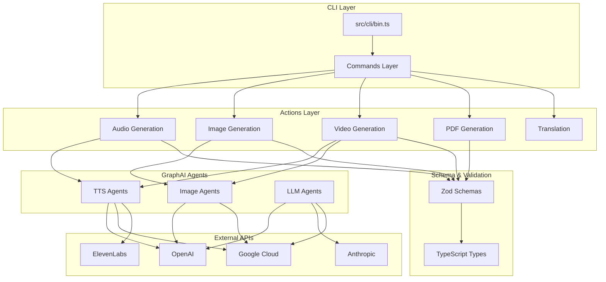
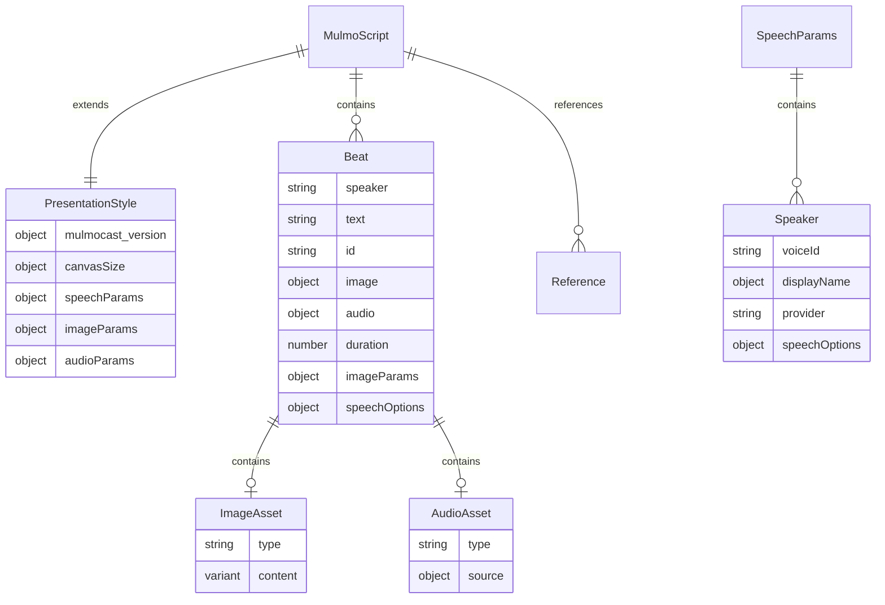
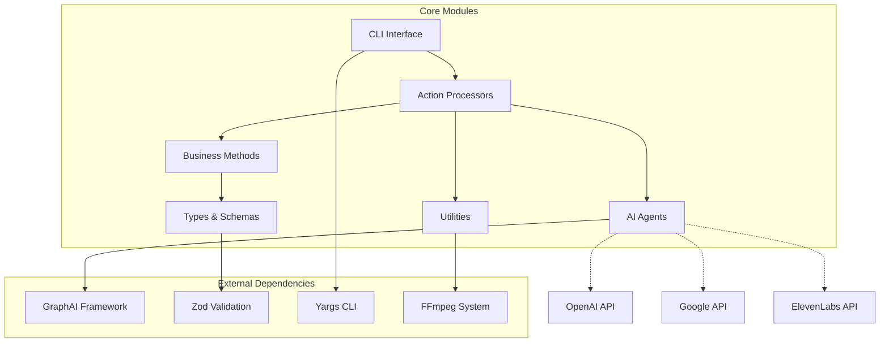

# TNE1: MulmoCast Existing Code Analysis

**Analysis Date:** 2025-06-14 12:28:00  
**Repository:** mulmocast-cli  
**Version:** 0.0.14  

## 1. Source Code Location

**Primary Source:** `./src/` directory  
**Entry Point:** [`src/cli/bin.ts`](src/cli/bin.ts:1) - Main CLI executable  
**Build Output:** `./lib/` directory (TypeScript compilation target)  

## 2. Language & Software Stack

### Core Technologies
- **Language:** TypeScript 5.7.3 (ES2021 target, NodeNext modules)
- **Runtime:** Node.js 16+ 
- **Package Manager:** npm
- **CLI Framework:** yargs 17.7.2
- **Schema Validation:** Zod 3.25.51
- **AI Orchestration:** GraphAI 2.0.5 framework

### AI Provider Integrations
- **OpenAI:** [@graphai/openai_agent](package.json:58) v2.0.3 (GPT models, DALL-E, TTS)
- **Google Cloud:** [@graphai/gemini_agent](package.json:55), [@google-cloud/text-to-speech](package.json:52)
- **Anthropic:** [@graphai/anthropic_agent](package.json:53) v2.0.2
- **Groq:** [@graphai/groq_agent](package.json:56) v2.0.0
- **ElevenLabs:** Custom TTS integration
- **Nijivoice:** Custom TTS integration

### Media Processing Dependencies
- **Video/Audio:** [fluent-ffmpeg](package.json:66) v2.1.3 (requires system ffmpeg)
- **Image Generation:** [canvas](package.json:63) v3.1.0
- **PDF Creation:** [pdf-lib](package.json:72) v1.17.1, [@pdf-lib/fontkit](package.json:62)
- **Web Automation:** [puppeteer](package.json:73) v24.10.0
- **Markdown:** [marked](package.json:70) v15.0.12

### Development Tools
- **TypeScript Build:** Native tsc compiler
- **Testing:** [@receptron/test_utils](package.json:80), tsx test runner
- **Linting:** eslint v9.28.0 with prettier integration
- **Development:** tsx v4.19.4 for watch mode

## 3. Program Organization & Architecture

### High-Level Architecture Diagram



### Directory Structure Analysis

#### Core Modules
- **[`src/cli/`](src/cli/)** - Command-line interface implementation
  - [`bin.ts`](src/cli/bin.ts:1) - Main entry point with yargs configuration
  - [`commands/`](src/cli/commands/) - Individual command implementations
  - [`helpers.ts`](src/cli/helpers.js:2) - CLI utility functions

#### Action Processors  
- **[`src/actions/`](src/actions/)** - Core content generation logic
  - [`audio.ts`](src/actions/audio.ts:1) - Audio file generation from text
  - [`images.ts`](src/actions/images.ts:1) - Image generation from prompts
  - [`movie.ts`](src/actions/movie.ts:1) - Video compilation from audio + images
  - [`pdf.ts`](src/actions/pdf.ts:1) - PDF document generation
  - [`translate.ts`](src/actions/translate.ts:1) - Multi-language translation

#### GraphAI Agent Layer
- **[`src/agents/`](src/agents/)** - AI provider integrations
  - [`tts_*.ts`](src/agents/) - Text-to-speech providers (OpenAI, Google, ElevenLabs, Nijivoice)
  - [`image_*.ts`](src/agents/) - Image generation providers (OpenAI, Google)
  - [`movie_google_agent.ts`](src/agents/movie_google_agent.ts) - Video generation via Google
  - [`validate_schema_agent.ts`](src/agents/validate_schema_agent.ts) - Schema validation

#### Type System & Validation
- **[`src/types/`](src/types/)** - Complete type definitions
  - [`schema.ts`](src/types/schema.ts:1) - Zod schema definitions (388 lines)
  - [`type.ts`](src/types/type.ts:1) - TypeScript type exports from schemas
  - [`cli_types.ts`](src/types/cli_types.ts) - CLI-specific type definitions

#### Business Logic
- **[`src/methods/`](src/methods/)** - Core business logic
  - [`mulmo_script.ts`](src/methods/mulmo_script.ts:1) - MulmoScript processing methods
  - [`mulmo_script_template.ts`](src/methods/mulmo_script_template.ts) - Template management
  - [`mulmo_studio_context.ts`](src/methods/mulmo_studio_context.ts) - Studio context management

#### Utilities
- **[`src/utils/`](src/utils/)** - Shared utility functions
  - [`ffmpeg_utils.ts`](src/utils/ffmpeg_utils.ts) - Video/audio processing
  - [`pdf.ts`](src/utils/pdf.ts) - PDF generation utilities
  - [`image_plugins/`](src/utils/image_plugins/) - Image processing plugins

## 4. Data Schema Analysis

### MulmoScript Schema (JSON/YAML Format)



### Key Schema Components

#### Core Script Structure ([`mulmoScriptSchema`](src/types/schema.ts:297))
- **Metadata:** title, description, language, references
- **Presentation Style:** canvas size, speech parameters, image/audio configurations  
- **Beats Array:** Individual content segments with text, media, and timing

#### Media Types ([`mulmoImageAssetSchema`](src/types/schema.ts:136))
- **Text Slides:** Title/bullet structured content
- **Markdown:** Rich text with formatting
- **Mermaid:** Diagram generation
- **Charts:** Chart.js data visualization
- **Images:** Static image assets
- **Movies:** Video content with audio mixing
- **HTML/Tailwind:** Custom styled content

#### Provider Integration ([`text2SpeechProviderSchema`](src/types/schema.ts:29))
- **Supported TTS:** openai, nijivoice, google, elevenlabs
- **Supported Image:** openai, google  
- **Supported Video:** openai, google

## 5. User Interface

### CLI Command Structure

```
mulmo <command> [options]

Commands:
├── translate <file>     # Translate MulmoScript to different languages
├── audio <file>         # Generate audio files from script
├── images <file>        # Generate images from script  
├── movie <file>         # Generate complete video (audio + images)
├── pdf <file>           # Generate PDF documents
└── tool <subcommand>    # Utility tools
    ├── scripting       # Generate MulmoScript from prompts/URLs
    ├── prompt          # Dump template prompts
    ├── schema          # Show JSON schema
    └── story_to_script # Convert story to MulmoScript
```

### Workflow Pattern
1. **Script Generation:** [`mulmo tool scripting`](README.md:122) - Interactive or URL-based script creation
2. **Content Processing:** [`mulmo movie`](README.md:141) - Generates audio, images, then combines into video
3. **Multi-format Output:** Video (MP4), Audio (MP3), Images (PNG), PDF, etc.

### Template System
- **Pre-built Templates:** business, children_book, coding, ghibli_strips, podcast_standard
- **Interactive Mode:** AI-guided script creation with user prompts
- **URL Processing:** Extract content from web pages for script generation

## 6. DevOps & Runtime Configuration

### Environment Setup
```bash
# Required
OPENAI_API_KEY=<key>

# Optional Enhancement
DEFAULT_OPENAI_IMAGE_MODEL=gpt-image-1  # Advanced image generation
GOOGLE_PROJECT_ID=<project_id>          # Google Cloud integration
ELEVENLABS_API_KEY=<key>                # ElevenLabs TTS
NIJIVOICE_API_KEY=<key>                 # Nijivoice TTS
BROWSERLESS_API_TOKEN=<token>           # Web content extraction
```

### System Dependencies
- **FFmpeg:** Required for video/audio processing
- **Node.js 16+:** Runtime requirement
- **System Fonts:** For PDF and image generation

### Build Process
1. **TypeScript Compilation:** `npm run build` → compiles `src/` to `lib/`
2. **Global Installation:** `npm install -g .` → installs `mulmo` command globally
3. **Development Mode:** `npm run dev` → tsx watch mode for development

## 7. Identified Shortfalls & Missing Components

### Current Limitations
1. **Error Handling:** Limited error recovery for API failures or malformed scripts
2. **Caching Strategy:** Basic file-based caching, no distributed cache support
3. **Performance:** Sequential processing, no parallel generation optimization
4. **Monitoring:** No built-in telemetry or performance metrics
5. **Configuration:** Limited runtime configuration beyond environment variables

### Missing Enterprise Features
1. **Authentication:** No user management or API key rotation
2. **Rate Limiting:** No built-in throttling for API providers
3. **Batch Processing:** No queue system for large-scale generation
4. **Storage Integration:** No cloud storage abstraction (S3, GCS, etc.)
5. **Webhooks:** No event notification system
6. **Plugin System:** Limited extensibility for custom providers

### Development Gaps
1. **Integration Tests:** Limited end-to-end testing with actual AI providers
2. **Documentation:** Missing API documentation for programmatic usage
3. **Docker Support:** No containerization for consistent deployment
4. **CI/CD Pipeline:** Basic npm scripts, no automated testing/deployment
5. **Monitoring Dashboard:** No operational visibility tools

## 8. Interconnected Module Relationships

### Module Dependency Flow



### Key Integration Points
- **[GraphAI Framework](package.json:68):** Orchestrates all AI agent interactions
- **[Zod Schemas](src/types/schema.ts:1):** Validates all data structures across modules  
- **[CLI Commands](src/cli/commands/):** Route user requests to appropriate action processors
- **[Agent System](src/agents/):** Abstracts AI provider differences behind common interfaces
- **[File System](src/utils/file.ts):** Manages output directories and asset organization

---

**2025-06-14 12:28:00** - Initial comprehensive code analysis completed covering architecture, schemas, dependencies, and identified improvement areas.